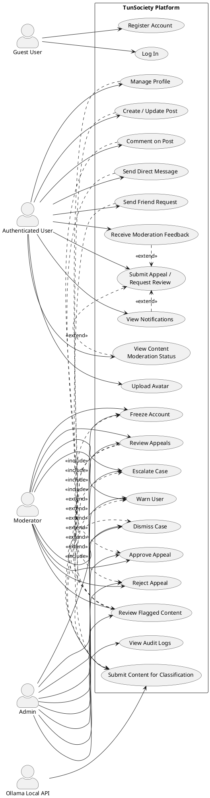
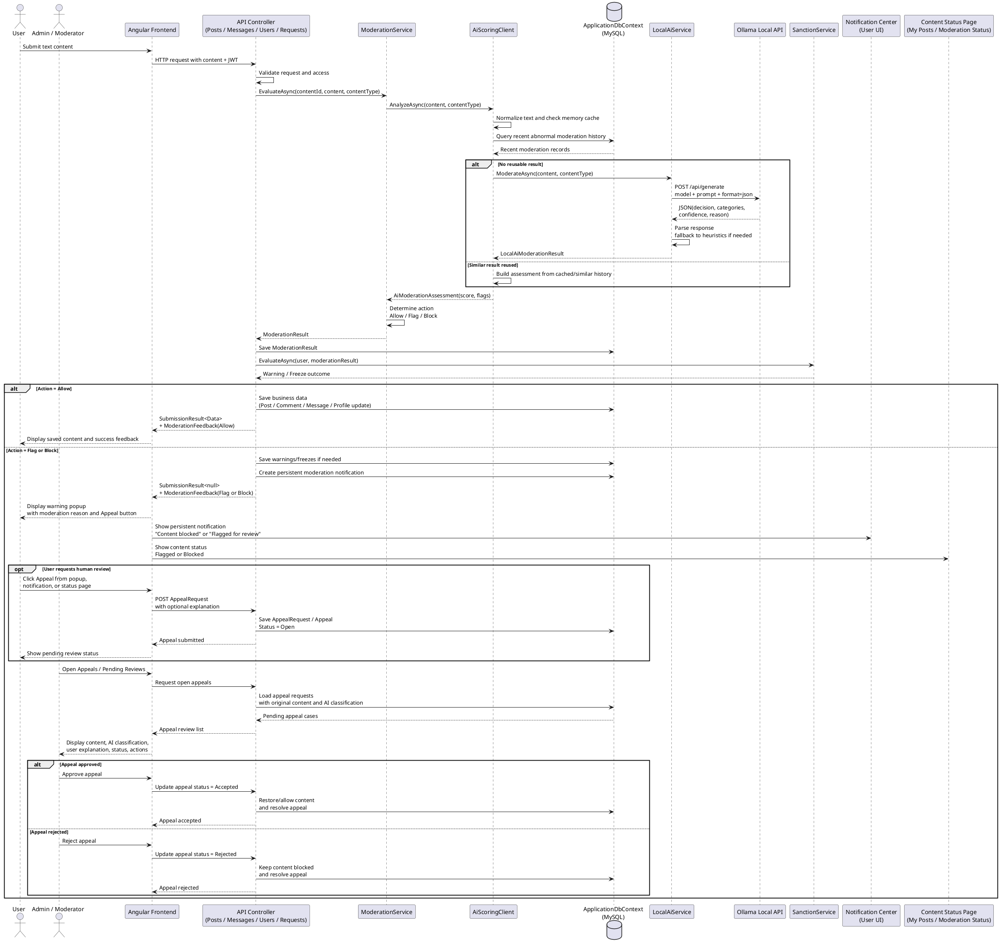

# TunSociety Project Documentation and AI Classification Report

## Introduction
TunSociety is a moderated social platform that combines user interaction features with an AI-assisted content review pipeline. The system allows users to register, manage profiles, create posts, comment, send messages, and send friend requests. At the same time, the platform applies automatic text moderation before content is stored or displayed.

The current implementation uses a local Ollama service to classify textual content. Internally, the backend uses three moderation decisions: `Allow`, `Flag`, and `Block`. For academic explanation, these decisions can be simplified as:

- `Normal` = `Allow`
- `Abnormal` = `Flag` or `Block`

This simplification is useful for presentations, while the real system keeps the richer three-level moderation logic.

A planned improvement to this moderation workflow is a user appeal feature for content that is flagged or blocked. The key design rule is that the appeal action must not exist only inside a temporary warning popup. The popup can provide an immediate `Appeal` or `Request Review` button, but the same action should remain available later through persistent notifications and a content moderation status page.

## 1. Use Case Diagram

### Main actors
- `Guest User`: a visitor who can register and log in.
- `Authenticated User`: a normal platform member who can publish content and interact with other users.
- `Moderator`: a trusted reviewer who handles flagged content and pending appeal reviews.
- `Admin`: the full-trust operator who reviews flagged content, warnings, freezes, appeals, and audit activity in the unified admin workspace.
- `Ollama Local API`: the external AI component used by the backend to classify text content.

### Main use cases
- Register account
- Log in
- Manage profile
- Upload avatar
- Create or update post
- Comment on post
- Send direct message
- Send friend request
- View notifications
- View content moderation status
- Receive moderation feedback
- Submit appeal / request review
- Submit content for AI classification
- Review flagged content
- Dismiss case
- Warn user
- Freeze account
- Escalate case for deeper review
- Review appeals
- Approve appeal
- Reject appeal
- View audit logs

### Interaction explanation
The authenticated user interacts with the social features of the system. Every important text field, such as profile name, post content, comment content, message content, or friend request note, is sent to the backend and checked by the moderation pipeline. If the text is considered normal, the data is stored and returned to the user interface. If the text is considered abnormal, the system may suppress the content, create a moderation record, issue a warning, or freeze the account after repeated violations.

For flagged or blocked content, the user should receive immediate moderation feedback in a warning popup, but this popup is only one access point. The system should also create a persistent notification such as `Your content was blocked.` or `Your content was flagged for review.` The user can later open the notification center or a `My Posts` / `Moderation Status` page to see the moderation status and submit an appeal.

The admin and moderator interact with the system through a unified review workspace. They do not need a separate moderation system. Instead, they review flagged cases, check user risk history, read audit logs, and choose a final action such as dismiss, warn, freeze, or escalate. In the appeal workflow, the admin or moderator also reviews pending appeals, reads the original content, checks the AI classification and user explanation, then accepts or rejects the appeal.

### PlantUML code


## 2. Class Diagram

### Main classes and entities
The system contains two major groups of classes:

1. `Domain entities`
These classes represent the main business data stored in the database, such as users, posts, messages, moderation results, warnings, freezes, appeals, and notifications.

2. `Service classes`
These classes implement the moderation logic, AI integration, sanction rules, caching, and communication with Ollama.

### Main classes
- `User`: stores identity, role, account status, and profile data.
- `Post`: stores user posts.
- `PostComment`: stores comments on posts.
- `PostReaction`: stores reactions to posts.
- `DirectMessage`: stores private messages between users.
- `FriendRequest`: stores user connection requests.
- `CommunityNotification`: stores notifications shown to users, including persistent moderation notifications that can link back to appeal actions.
- `ModerationResult`: stores the AI moderation decision, score, reason, and escalation state.
- `Warning`: stores moderation warnings.
- `Freeze`: stores account freeze periods.
- `Appeal`: stores appeal requests related to moderation decisions. In UI planning this is the `AppealRequest` record created when a user asks for human review.
- `ModerationService`: converts AI scores and flags into platform decisions.
- `AiScoringClient`: prepares text analysis, reuses cached or similar moderation history, and calls the local AI service.
- `LocalAiService`: sends the moderation prompt to Ollama and parses the response.
- `SanctionService`: applies warnings and freezes based on moderation results.

### Relationship explanation
`User` is the central class. A user can create many posts, comments, reactions, friend requests, direct messages, notifications, moderation results, warnings, freezes, and appeals. `Post` has many comments and reactions. `ModerationResult` is linked to a user and represents the moderation decision for a specific content item. `Appeal` records the user's optional explanation, current status, target content or moderation action, and resolution time. The service classes do not represent stored business data; instead, they orchestrate the moderation and sanction workflow.

### PlantUML code


```plantuml
@startuml
skinparam classAttributeIconSize 0
skinparam packageStyle rectangle

package "Domain Entities" {
  class User {
    +Id : Guid
    +UserName : string
    +Email : string
    +DisplayName : string
    +Gender : string
    +Age : int?
    +AvatarUrl : string
    +Role : string
    +IsFrozen : bool
    +CreatedAtUtc : DateTime
  }

  class Post {
    +Id : Guid
    +UserId : Guid
    +Title : string
    +Content : string
    +ImageUrl : string?
    +Visibility : string
    +CreatedAtUtc : DateTime
    +UpdatedAtUtc : DateTime?
  }

  class PostComment {
    +Id : Guid
    +PostId : Guid
    +UserId : Guid
    +Content : string
    +CreatedAtUtc : DateTime
  }

  class PostReaction {
    +Id : Guid
    +PostId : Guid
    +UserId : Guid
    +ReactionType : string
    +CreatedAtUtc : DateTime
  }

  class DirectMessage {
    +Id : Guid
    +SenderUserId : Guid
    +RecipientUserId : Guid
    +Content : string
    +CreatedAtUtc : DateTime
    +IsRead : bool
    +ReadAtUtc : DateTime?
  }

  class FriendRequest {
    +Id : Guid
    +RequesterUserId : Guid
    +RecipientUserId : Guid
    +Status : string
    +Note : string?
    +CreatedAtUtc : DateTime
    +UpdatedAtUtc : DateTime?
  }

  class CommunityNotification {
    +Id : Guid
    +UserId : Guid
    +Type : string
    +Title : string
    +Detail : string
    +IsRead : bool
    +CreatedAtUtc : DateTime
  }

  class ModerationResult {
    +Id : Guid
    +ContentId : Guid
    +ContentType : string
    +UserId : Guid
    +ContentSnapshot : string
    +Score : double
    +Action : string
    +Reason : string?
    +IsEscalated : bool
    +EscalatedAtUtc : DateTime?
    +EscalationNote : string?
    +FlagsData : string
    +CreatedAtUtc : DateTime
    +get Flags() : List<string>
  }

  class Warning {
    +Id : Guid
    +UserId : Guid
    +Reason : string
    +IssuedAtUtc : DateTime
  }

  class Freeze {
    +Id : Guid
    +UserId : Guid
    +Reason : string
    +StartsAtUtc : DateTime
    +EndsAtUtc : DateTime?
    +IsActive : bool
  }

  class Appeal {
    +Id : Guid
    +UserId : Guid
    +TargetType : string
    +TargetId : Guid
    +Status : string
    +Reason : string?
    +CreatedAtUtc : DateTime
    +ResolvedAtUtc : DateTime?
  }

  note right of Appeal
    Represents AppealRequest in UI planning.
    Targets flagged/blocked content or a sanction.
  end note
}

package "Moderation Services" {
  class ModerationService {
    +EvaluateAsync(contentId: Guid, content: string, contentType: string) : Task<ModerationResult>
  }

  class AiScoringClient {
    +AnalyzeAsync(content: string, contentType: string) : Task<AiModerationAssessment>
    +ScoreAsync(content: string, contentType: string) : Task<double>
  }

  class LocalAiService {
    +ModerateAsync(content: string, contentType: string) : Task<LocalAiModerationResult>
  }

  class SanctionService {
    +EvaluateAsync(user: User, result: ModerationResult) : Task<SanctionOutcome>
  }
}

package "External Service" {
  class "Ollama Local API" as OllamaApi <<external>> {
    +POST /api/generate
  }
}

Post --> User : author
PostComment --> Post : belongs to
PostComment --> User : author
PostReaction --> Post : belongs to
PostReaction --> User : reacted by
DirectMessage --> User : sender
DirectMessage --> User : recipient
FriendRequest --> User : requester
FriendRequest --> User : recipient
CommunityNotification --> User : target user
ModerationResult --> User : subject user
Warning --> User : issued to
Freeze --> User : applied to
Appeal --> User : created by

ModerationService --> AiScoringClient
AiScoringClient --> LocalAiService
AiScoringClient ..> ModerationResult : reuses prior results
SanctionService ..> Warning
SanctionService ..> Freeze
SanctionService ..> User
SanctionService ..> ModerationResult
LocalAiService --> OllamaApi
@enduml
```

## 3. Sequence Diagram

### Main flow
The main system flow begins when a user submits textual content through the frontend. The frontend sends the data to the backend API. The backend validates the request and calls the moderation pipeline. The moderation pipeline consults local cache and recent moderation history, then sends the content to Ollama if needed. Ollama returns a structured JSON response. The backend transforms this response into a moderation result and decides whether the content should be allowed, flagged, or blocked.

If the result is `Allow`, the content is stored and sent back to the frontend. If the result is `Flag` or `Block`, the content may be suppressed, a warning may be created, and the account may eventually be frozen after repeated violations. The result is then shown in the frontend through an immediate warning popup. The backend should also keep a persistent moderation record, create a notification, and expose the item on a content status page so the user can still appeal later if the popup is closed.

The appeal path begins when the user chooses `Appeal` or `Request Review` from the popup, the notification center, or the content status page. The user may optionally write an explanation. The backend stores this as an appeal request, represented by the `Appeal` entity in the current codebase. The admin or moderator sees the request in the `Appeals` or `Pending Reviews` dashboard, reviews the original content, AI classification, user explanation, and current status, then accepts or rejects the appeal.

### PlantUML code


## 4. Research Part: Ollama and Classification

### Role of Ollama in this project
Ollama is used as a local AI inference engine for text moderation. It does not directly read the whole project database or the entire application state. Instead, the backend sends selected text content to Ollama whenever content moderation is required.

Examples of moderated inputs in the current project are:
- full name at registration
- display name during profile update
- post title and content
- post comments
- public messages
- direct messages
- friend request notes

### Binary explanation: Normal and Abnormal
For a simple academic explanation:
- `Normal` means the content is acceptable and the backend keeps the decision as `Allow`.
- `Abnormal` means the content is suspicious or harmful. In the real system, this is split into:
  - `Flag`: borderline or review-needed content
  - `Block`: clearly forbidden content

Therefore, the implemented system is more precise than a simple binary classifier.

### How the input data is sent to Ollama
The backend builds a structured moderation prompt that contains:
- the content itself
- the content type, for example `PROFILE`, `POST`, `COMMENT`, or `MESSAGE`
- moderation instructions
- the required output format in JSON

The backend then sends an HTTP `POST` request to Ollama at:
- `http://localhost:11434/api/generate`

The current configuration in the project uses a local moderation model:
- `gemma3:1b`

### How Ollama processes the data
Ollama runs the selected local model and processes the prompt as an inference request. It returns JSON-like output with four main fields:
- `decision`
- `categories`
- `confidence`
- `reason`

Example conceptual output:
```json
{
  "decision": "BLOCK",
  "categories": ["hate", "racism"],
  "confidence": 0.97,
  "reason": "Blocked due to moderation category: racism."
}
```

### How the response is returned
The backend service `LocalAiService` reads the Ollama response, extracts the JSON payload, validates the fields, normalizes the decision, and keeps only allowed categories such as:
- abuse
- hate
- political
- pornography
- racism
- scam
- spam
- threat
- violence

If Ollama fails or returns invalid data, the project uses a fallback heuristic classifier based on keyword rules. This increases reliability and allows the system to keep working even if the local model is unavailable.

### How the system uses the result
After receiving the AI result:
1. `AiScoringClient` converts the Ollama decision and confidence into a moderation score and list of flags.
2. `ModerationService` converts that assessment into one of three actions:
   - `Allow`
   - `Flag`
   - `Block`
3. The backend stores a `ModerationResult` record in the database.
4. `SanctionService` may create a warning or freeze the account if the user repeatedly submits blocked content.
5. The frontend receives a `SubmissionResult<T>` object and displays either:
   - the saved content, or
   - a warning popup explaining why the content was rejected or suppressed
6. If the content is flagged or blocked, the system should create a persistent notification and show the item on a content status page with one of these user-facing states:
   - `Approved`
   - `Flagged`
   - `Blocked`
7. The user can submit an appeal from the warning popup, notification center, or content status page. The backend stores the appeal request as an `Appeal` record, conceptually an `AppealRequest`.
8. If the content is abnormal or appealed, the admin can later review it in the unified admin workspace.

### Important implementation detail
The system also optimizes performance before sending text to Ollama:
- it checks exact moderation cache in memory
- it can reuse similar recent abnormal moderation results from the database

This means Ollama is used intelligently, not blindly, for every repeated input.

## 5. Data Source

### 5.1 User input
The most important source of data is user-submitted text. Examples include:
- registration full name
- profile display name
- post title and post content
- post comments
- public messages
- direct messages
- friend request notes

This is the primary data sent to Ollama for classification.

### 5.2 Database records
The application stores and reads structured data from the database, including:
- `Users`
- `Posts`
- `PostComments`
- `PostReactions`
- `Messages`
- `DirectMessages`
- `FriendRequests`
- `ModerationResults`
- `Warnings`
- `Freezes`
- `Appeals`
- `Notifications`
- `AuditLogs`

The moderation subsystem also reuses recent `ModerationResults` to avoid unnecessary repeated AI calls for highly similar abnormal content.

Appeal-related records should include the target content or moderation action, the current status, the optional user explanation, and the resolution timestamp. Notification records should preserve moderation outcomes so the user can return later and still request review even after closing the original popup.

### 5.3 Audit logs and application history
The project contains an `AuditLog` entity for administrative traceability. These logs record actions such as content creation, moderation review, warnings, freezes, dismissals, and escalations. In this project, audit logs are mainly used for administration and traceability, not as direct raw input to Ollama.

Therefore, if the report mentions `system logs`, it is more accurate here to say `application audit logs` rather than operating-system log files.

### 5.4 Uploaded files
The current project allows avatar image upload using `IFormFile`. These files are stored by the backend through `AvatarStorageService`. However, avatar images are not currently sent to Ollama for AI classification in the present implementation.

### 5.5 API responses
Two important categories of API response exist:
- Ollama responses returned to the backend in JSON form
- backend responses returned to the frontend, such as `SubmissionResult<T>` and moderation feedback

These responses are important because they determine what the user or admin sees in the interface.

### 5.6 Other internal sources
The system also uses:
- in-memory cache for exact repeated moderation inputs
- similarity reuse from recent abnormal moderation history
- configuration values from `appsettings.json`, such as Ollama base URL and model name

## 6. Comparison with Other Models and Approaches

The following comparison is qualitative. It is based on common engineering tradeoffs and the needs of this project, not on a formal benchmark of every model in the same hardware environment.

| Approach | Accuracy | Cost | Ease of Integration | Privacy | Local Execution | Performance | Customization |
|---|---|---|---|---|---|---|---|
| Ollama with local open-source model | Medium to High, depending on the chosen model | Low after local setup | Easy, because it exposes a simple local HTTP API | High | Yes | Good on adequate local hardware | High |
| OpenAI cloud models | Often High to Very High | Ongoing API cost | Very easy | Medium, because data leaves the local machine unless special controls exist | No | High, but network dependent | Medium |
| Hugging Face models (self-hosted) | Medium to High, depending on model and setup | Low to Medium | Medium, because deployment and inference setup can be more complex | High when self-hosted | Yes | Hardware dependent | Very High |
| Traditional machine learning | Medium when trained on good labeled data | Low at runtime, but training and labeling cost effort | Medium | High | Yes | Very fast at runtime | Medium |
| Rule-based classification | Low to Medium | Very Low | Very easy | High | Yes | Very fast | Low to Medium |

### Discussion
`OpenAI models` are generally strong in language understanding, but they require network calls to external servers and may increase cost over time.

`Hugging Face models` provide very strong flexibility and many model choices. However, direct deployment and serving can require more engineering work than Ollama.

`Traditional machine learning` can be efficient and fast, especially for fixed classification tasks, but it usually requires labeled datasets, feature engineering, retraining, and maintenance.

`Rule-based methods` are deterministic and cheap, but they are weak for nuanced language, sarcasm, context, spelling variation, and evolving harmful content.

`Ollama` offers a practical middle position for this project: it provides modern LLM behavior, local execution, and a simple integration model.

## 7. Why Choose Ollama?
Ollama was chosen because it fits the technical and privacy requirements of TunSociety very well.

First, Ollama can run locally on the same machine or local server. This is important because the project moderates potentially sensitive text such as names, messages, and user-generated posts. Local execution reduces the need to send sensitive data to third-party servers.

Second, Ollama is easy to integrate into backend systems. In this project, the backend sends a simple HTTP request to the local Ollama API and receives a structured response. This makes the integration straightforward for ASP.NET backend services.

Third, Ollama supports multiple open-source models. This is useful for experimentation because the team can test different models without changing the overall system architecture.

Fourth, Ollama can reduce API cost. Once the local environment is prepared, inference can be performed without paying an external API fee for each request.

Finally, Ollama is well suited for local AI development, research, and prototyping. It allows the project to evolve gradually, from prompt-based moderation to more advanced local AI workflows if needed.

## 8. Questions About the Model

### Question 1: How did you use this model?
The model was integrated into the backend through a service called `LocalAiService`. When a user submits text, the backend sends that text and its content type to the moderation pipeline. The moderation pipeline calls Ollama through a local HTTP API request. Ollama returns a moderation decision, categories, confidence, and reason. The backend then transforms this result into a platform action such as `Allow`, `Flag`, or `Block`. Finally, the system stores the moderation result, applies warnings or freezes if needed, and returns the final status to the frontend.

### Question 2: What data does Ollama use?
Ollama does not automatically know or read the project data by itself. It only uses the input that the application sends to it in the prompt or request body. In this project, that input can come from user text, database-derived content snapshots, or other selected application data. Therefore, the real data source is the application, not Ollama alone.

Possible project data sources include:
- user input
- database records
- audit history
- uploaded files metadata
- API responses

However, only the data explicitly sent by the backend is processed by Ollama.

### Question 3: What are the steps to develop an AI model?
The development of an AI model or AI-based classification system usually follows these steps:

1. `Define the problem`
Determine exactly what the model should do. In this project, the problem is content moderation and abnormal content detection.

2. `Collect data`
Gather the relevant data, such as text messages, posts, profile names, or historical moderation examples.

3. `Clean and prepare the data`
Remove noise, normalize text, label examples if needed, and define the target categories.

4. `Choose the model or algorithm`
Select an approach such as a local LLM, a cloud model, a Hugging Face model, a classical machine learning classifier, or a rule-based system.

5. `Train or configure the model`
If the model requires training, train it with prepared data. If the model is prompt-based, configure prompts, thresholds, categories, and output format.

6. `Test and evaluate the model`
Measure accuracy, false positives, false negatives, latency, and robustness on real or representative examples.

7. `Integrate the model into the application`
Connect the model to the backend or frontend through APIs or service classes and define how the result affects the business logic.

8. `Monitor and improve the model`
Observe errors, user feedback, edge cases, cost, and latency, then refine the model, prompts, thresholds, or fallback logic.

## 9. Appeal Feature and UI Planning

### Feature goal
When user content is flagged or blocked by the AI moderation system, the user should be able to appeal the decision and request human review. The appeal option must not exist only inside a temporary warning popup because the user may close the popup by mistake.

The existing project already contains appeal-related admin concepts, including the `Appeal` entity and the admin appeals workspace. The planned improvement expands the user-facing workflow so appeals can be started reliably from multiple places.

### User warning popup
When a post, comment, profile update, message, or request note is flagged or blocked, the frontend should show a warning popup. The popup should explain the moderation outcome, show the reason returned by the moderation pipeline when available, and include an `Appeal` or `Request Review` button.

This popup is only the immediate access point. It should not be the only way to appeal.

### Notification center
The backend should create a persistent notification for moderation actions. Example notification titles include:
- `Your content was blocked.`
- `Your content was flagged for review.`

When the user opens the notification later, the notification detail should still provide access to the appeal action or link to the relevant moderation status page. This makes the appeal option recoverable after accidental popup closure.

### Content status page
The user dashboard should include a persistent content status area, such as `My Posts` or `Moderation Status`. Each content item should show a clear status:
- `Approved`
- `Flagged`
- `Blocked`

The UI label `Approved` maps to the backend moderation action `Allow`. The UI labels `Flagged` and `Blocked` map to the backend actions `Flag` and `Block`. If a content item is flagged or blocked, the row should show an `Appeal` button.

### Appeal flow
The appeal flow should work as follows:

1. User clicks `Appeal` or `Request Review`.
2. User optionally writes an explanation.
3. Backend stores the request as an `AppealRequest`, represented in the current codebase by the `Appeal` entity.
4. The appeal status starts as `Open` or `Pending Review`.
5. Moderator sees the appeal in the admin or moderator dashboard.
6. Moderator approves the appeal and restores or allows the content, or rejects the appeal and keeps the content blocked.

### Moderator dashboard
The moderator/admin workspace should include an `Appeals` or `Pending Reviews` section. For each appeal, the reviewer should see:
- original content
- AI classification
- user explanation
- current status
- actions: `Approve` / `Reject`

The current admin appeals area already supports reviewing appeal status. The planned content appeal workflow should extend this evidence view so the reviewer can evaluate the original moderated content and the AI moderation reason alongside the user's explanation.

### Jury explanation
"The popup is not the only access point. The system keeps a persistent record of moderation actions through notifications and content status pages, where the user can still access the appeal option later. This improves user experience and prevents losing important actions because of accidental popup closure."

## Conclusion
TunSociety uses Ollama as a local AI moderation component inside a broader backend architecture. The system does not rely only on the model output. Instead, it combines prompt-based classification, caching, similarity reuse, moderation result storage, sanction rules, and admin review. This architecture makes the system more practical for a real application.

From a report perspective, the project can be presented as an AI-assisted social platform where normal content is allowed, abnormal content is flagged or blocked, users can request human review through persistent appeal access points, and final control remains in the application logic and the admin workspace.
